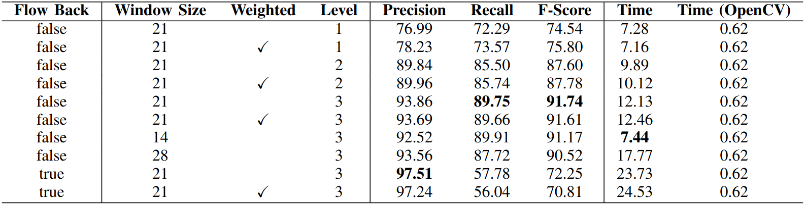
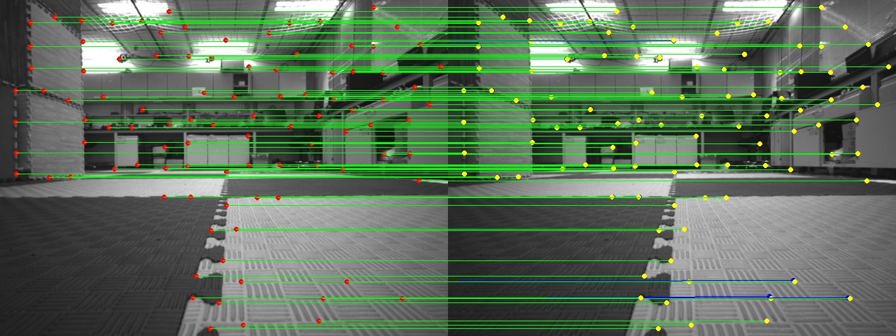

## KLT (Kanade-Lucas-Tomasi) Tracker
In this project, we developed a KLT optical flow from scratch and attempted various enhancement strategies, including image pyramids, smoothing weights, and affine matrix estimation. The experiments demonstrated that although our self-implemented optical flow still has some gap with the OpenCV library, it can achieve a good performance.

## Experiment


Note: this experiment is done on a video which is not included in this repo. In this repo, we only provide a pair of images for testing.

For our test demo, we use the following result:
```angular2html
frame id: 0, precision: 96.9388%, recall: 81.8966%, f1: 88.785%, time: 12.1133ms, time_opencv: 0.590632ms
```



where the red points are the original points, the yellow points are the tracked points by OpenCV, and the blue points are the tracked points by our implementation.
## Usage
```angular2html
mkdir build
cd build
cmake ..
make
./optlk_benchmark
```

## TODO
If you have any interest in this project, you can try to implement the following features:
- [ ] Implement the affine matrix estimation
- [ ] Implement the multi-thread version to speed up the process